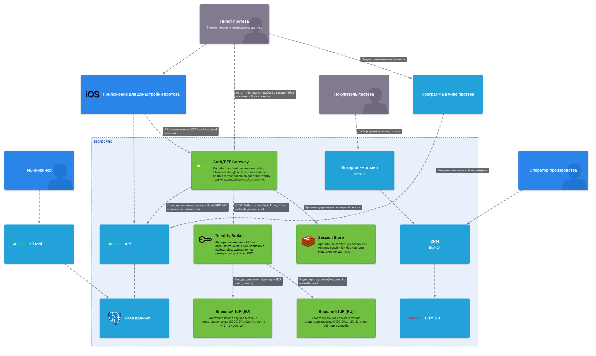
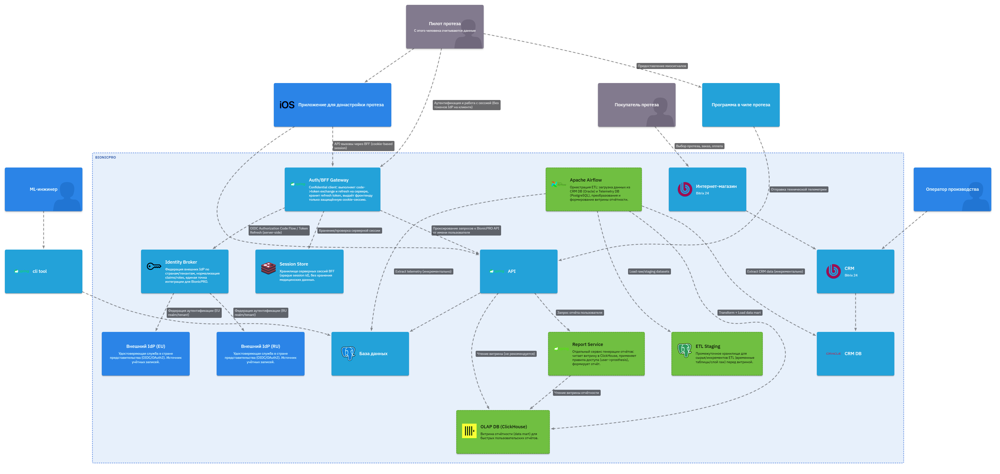

# BionicPro

## Задание 1. Повышение безопасности системы

### Задача 1. Предложите архитектурное решение и доработайте диаграмму C4 для управления учётными данными пользователя.

Решение должно учитывать и обеспечивать следующие аспекты:

* Унификацию доступа в системе BionicPRO. Это будет осуществляться через запрос данных учётных записей из внешнего источника, который расположен в стране представительства компании. Принципы локального хранения персональной и медицинской информации не должны быть нарушены.
* Безопасную схему работы с access- и refresh-токенами, которая исключает передачу фронтенду токенов, которые были получены от IdP.
* Возможность поддержки аутентификации пользователей через различные внешние удостоверяющие службы, действующие в разных странах.

#### Архитектурное решение

1) Унификация доступа и «локальность» данных

В каждой стране присутствия есть внешний источник учётных записей (IdP/IdM), который аутентифицирует пользователя и хранит идентификационные данные по требованиям страны; BionicPRO не переносит «сырые» персональные/медицинские данные между странами, а получает только минимально необходимую идентификационную информацию (например, subject id, email/phone, набор claims/roles) через стандартные протоколы OIDC/OAuth2.

Внутри BionicPRO добавляется компонент Auth/BFF Gateway (можно как отдельный сервис или расширение текущего API), который выступает «confidential client» и делает все обмены code→tokens и refresh на сервере, тем самым унифицируя вход для любых внешних IdP.

Для поддержки разных IdP в разных странах добавляется Identity Broker (может быть Keycloak как брокер, либо отдельный federation-сервис), который маршрутизирует аутентификацию в нужный внешней IdP по country/tenant/realm и нормализует claims в единый формат для BionicPRO.

2) Безопасная схема access/refresh без передачи токенов IdP на фронт

Фронтенд (мобильное приложение) не получает access/refresh токены от IdP; вместо этого получает только HttpOnly Secure cookie с идентификатором серверной сессии (или opaque session token), а все вызовы в BionicPRO идут на Auth/BFF Gateway.

Auth/BFF Gateway хранит refresh token (и при необходимости access token) сервер-сайд и по мере надобности обновляет access token через refresh flow; RFC подчёркивает важность аутентификации клиента при использовании refresh token, что естественно выполняется на сервере (confidential client), а не на фронтенде (public client).

Дополнительно можно поддержать back-channel logout (server-to-server) для принудительного завершения сессии в BFF при логауте/ревоке на стороне IdP.



### Задача 2. Улучшите безопасность существующего приложения, заменив Code Grant на PKCE.

Его нужно добавить к уже существующим приложениям — фронтенду и Keycloak. Мы неслучайно не рассказывали в теории, как это сделать. Чтобы разобраться, изучите [официальную документацию](https://www.keycloak.org/docs/latest/server_admin/index.html#device-authorization-grant).

#### Настройка

##### 1. Keycloak: Делаем PKCE обязательным для клиента, который указан в `reports-frontend`.

1) Admin Console → Realm → **Clients** → клиент `reports-frontend`.
2) Вкладка **Settings**:
   - **Client authentication**: `OFF`.
   - **Standard flow**: `ON`.
   - **Direct access grants**: `OFF` .
   - **Implicit flow**: `OFF`.
3) Вкладка **Advanced** → блок **Advanced settings**:
   - **Proof Key for Code Exchange Code Challenge Method**: `S256`.
4) **Save**.

Keycloak начинает требовать `code_challenge` в запросе `/auth` и проверять `code_verifier` на `/token` (то есть code перехватить “в одиночку” уже нельзя).

##### 2. Frontend

`ReactKeycloakProvider` получает `authClient={keycloak}`, но не передаются `initOptions`. В `keycloak-js` PKCE включается через `pkceMethod: 'S256'` в `init`.

```tsx
  <ReactKeycloakProvider
    authClient={keycloak}
    initOptions={{
      onLoad: "check-sso",
      pkceMethod: "S256",
      checkLoginIframe: false,
    }}
  >
```

##### 3. Проверка, что PKCE реально включился

Параметры запроса `http://localhost:8080/realms/reports-realm/protocol/openid-connect/token`:

| Параметр      | Значение                                                                                                       |
|---------------|----------------------------------------------------------------------------------------------------------------|
| code          | 483e21bc-47b0-42e1-aa92-0a804b6398f6.aafd0c3f-6e36-48a5-9469-f21224462837.30d7612c-dc0b-4e1d-b7ad-dde66eb0471a |
| grant_type    | authorization_code                                                                                             |
| client_id     | reports-frontend                                                                                               |
| redirect_uri  | http://localhost:3000/                                                                                         |
| code_verifier | k3UWyOOz4nPB771rYi042B03eF4CavehwrwioPpEjauSdln9Ei2bMX5GA1v7DwIZxK98VkNTlsLYNZbRMiuJYH6w0WAPmKip               |

Пример ответа:
```json
{
    "access_token": "...",
    "expires_in": 300,
    "refresh_expires_in": 1800,
    "refresh_token": "...",
    "token_type": "Bearer",
    "id_token": "...",
    "not-before-policy": 0,
    "session_state": "...",
    "scope": "openid email profile"
}
```

### Задача 3. Обеспечьте безопасное получение и хранение access-и refresh-токенов.

1. Перенесите механизм запроса access- и refresh-токен из фронтенда в новый бэкенд-сервис, который реализует интеграцию с Keycloak и работу с сессиями.
2. Назовите сервер bionicpro-auth. Написать его можно на любом из стандартных для бэкенда языков — Java, C#, Go, Python. Можно использовать либы и фреймворки.
3. Ограничений по выбору языка нет. Можно использовать фреймворки и библиотеки для реализации задания, например, для Java — Spring Security.
4. Настройте Keycloak на работу с refresh_token. Установите время работы access_token — не более 2 минут.
5. При успешной авторизации на бэкенде сохраните refresh_token на защищённом хранилище или в зашифрованном виде в оперативной памяти, или в распределённом кеше.
6. Сохраните access_token в оперативной памяти сервера либо в распределённом кеше.
7. Обеспечьте привязку access_token и refresh_token к сессии.
8. В ответе фронтенду вместо токенов отдайте сессионную cookie c HTTP-only и Secure-флагами.
9. Время жизни сессии должно быть больше времени жизни access_token, чтобы при истечении access_token можно было обновить access_token через refresh_token.
10. Обновите код фронтенд-приложения, убрав из него механизм получения токенов и сделав обязательным прокидывание на бэкенд сессионной cookie.
11. Если access_token устареет, то сервис сам должен сходить за новым в keycloak, используя refresh token.
12. Реализуйте ротацию сессии в рамках действующего access_token для предотвращения session fixation attack. Для этого при очередном запросе к защищённому ресурсу при успешной проверке сессии на сервисе он перепривязывает access_token и refresh_token к новому session id, обновляет cookie и возвращает новый session id в ответе фронтенду.

### Задача 4. Добавьте LDAP для возможности получения данных о пользователях представительства BionicPRO в другой стране.

1. Разверните LDAP-сервер OpenLDAP. Файл конфигурации развёртывания и также файл ldif с пользователями и ролями лежит в репозитории спринта.
2. Настройте Keycloak, чтобы он ходил в LDAP-сервер за авторизацией пользователей.
3. Добавьте маппинг ролей для синхронизации ролей разных представительств BionicPRO.

### Задача 5. Настройте MFA.

1. Настройте в Keycloak механизм OTP-аутентификации.
2. Включите обязательный ввод одноразового пароля для всех пользователей.
3. Убедитесь, что под пользователем можно войти в систему только после ввода одноразового пароля из Google Authenticator или FreeOTP.

### Задача 6. Добавьте OAuth 2.0 от Яндекс ID.

1. Используя механизм Identity Brokering, реализуйте аутентификацию пользователей через внешний Identity Prodider Яндекс ID. Обратите внимание, что сервис протезов получает данные профиля пользователя из Яндекса.
2. После аутентификации сервис должен спрашивать пользователя о разрешении использовать данные.
3. Сервис должен запрашивать у Яндекса данные профиля и сохранять их в БД.

### Мини-отчёт с 3 по 6 задание

Все настройки для работы с `LDAP` и `Yandex ID` - расположены в `keycloak/realm-export.json`, что позволяет при запуске `Keycloak` сразу использовать готовые настройки.

Добавлен `Redis`-контейнер для хранения пользовательских сессий.

В `React` приложении удалены настройки по работе с `Keycloack`, но добавлены url для работы с `bionicpro-report`, а также сохранена работа с сессией.

## Задание 2. Разработка сервиса отчётов

Пользователи хотят, чтобы у них была возможность получать данные о работе своего протеза и просматривать их в виде отчёта.

Вам нужно написать отдельный сервис для отчётов. Он будет генерировать отчёты из данных, которые собираются из разных источников, — CRM и DB.

### Задача 1. Создать архитектуру решения для подготовки и получения отчётов.

Решение должно включать в себя ETL-процесс, который объединяет данные с датчиков и данные из CRM, используя Apache Airflow, и формирует готовую витрину отчётности в OLAP БД. Итоговый отчёт по пользователю должен быть доступен через бэкенд-сервис API, который обозначен на исходной архитектуре.



### Задача 2. Разработать Airflow DAG и настроить его на запуск по расписанию.

1. Реализуйте ETL-процесс с использованием Airflow, который будет извлекать данные из CRM-системы и записывать их в базу OLAP.

2. Подготовьте витрину — отдельную таблицу для сервиса отчётов, в которой вам предстоит объединить данные телеметрии и данные о клиентах из CRM-системы. Для этого нужно будет сгруппировать аналитику по телеметрии в разрезе клиентов. Спроектируйте структуру витрины таким образом, чтобы обеспечить быстрый доступ к данным по пользователям. За основу при написании DAG можно взять материал уроков спринта.

3. Настройте расписание сбора данных и подготовки витрины.

### Задача 3. Создайте бэкенд-часть приложения для API.

Выберите удобный для вас язык — Python, Java, C# или любой другой.

Добавьте API /reports в этот бэкенд для передачи отчётов, который будет возвращать подготовленный отчёт по заданному пользователю. Отчёт должен запрашиваться из OLAP-базы без необходимости выполнять сложные вычисления в реальном времени.

### Задача 4. Реализуйте ограничение доступа к эндпоинту отчётности.

Доступ к отчёту по пользователю должен предоставляться только в отношении себя.

### Задача 5. Добавьте в UI кнопку получения отчёта и вызова эндпоинта его генерации.

### Отчет по заданию

Добавлена папка `bionicpro-airflow`, которая содержит:
* `dags/crm_to_clickhouse.py` - даг для извлечения данных и crm-db и записи в clickhouse;
* `Dockerfile`;
* `uv`-зависимости;
* `init/create_connections.sh` - скрипт для инициализации соединений.

Добавлена папка `bionicpro-crm`, которая содержит:
* `init/01_schema.sql` - скрипт для создания таблицы;
* `init/02_seed.sql` - скрипт для добавления тестовых данных.

Добавлена папка `clickhouse`, которая содержит:
* `users.d/default.xml` - настройки пользователя.

Добавлена папка `bionicpro-report` - микросервис для получения данных из clickhouse и генерации pdf-отчёта.

Добавлен `docker-compose.etl.yaml`, для запуска контейнеров для ETL.

В приложение `frontend` добавлена возможность скачивания отчёта.

## Задание 3. Снижение нагрузки на базу данных

После внедрении фичи о получении пользовательской отчётности нагрузка на базу данных отчётности существенно возросла. Пользователи стали часто запрашивать свои отчёты. Но поскольку данные обновляются с помощью ETL-процесса по расписанию, на эти запросы пользователи получают одинаковые отчёты.

Ваша задача — во-первых, снизить нагрузку на OLAP-базу, исключив необходимость повторных запросов для уже сформированных отчётов, а во-вторых, разработать механизм, который будет сохранять отчёты по пользователям в объектное хранилище S3 и раздавать их через CDN.

### Что нужно сделать

1. Добавьте в API-сервис реализацию записи сформированных отчётов в объектное хранилище, поддерживающее S3 API (Ceph, Minio). Конфигурация развёртывания Minio находится в репозитории спринта.
2. При запросе отчёта сервис сначала проверяет наличие отчёта в S3. Если он там есть, то отдаёт ссылку на CDN. Если же отчёт не обнаружен, сервис должен его сгенерировать, положить в S3 и отдать ссылку на CDN в ответе. Для эмуляции CDN необходимо поднять и настроить Nginx как reverse proxy c включённым кешированием статических файлов.
3. Продумать механизм обновления кеша в CDN и структуру хранения отчётов в S3 для быстрого доступа.

### Отчет по заданию

Добавлена папка `bionicpro-cdn`, которая содержит настройки для `nginx.conf`.

Добавлен `docker-compose.cnd.yaml`, для запуска контейнеров для S3 и Nginx в качестве CDN.

В приложение `bionicpro-report` добавлена поддержка работы с S3 - загрузка и получение отчётов.

## Задание 4. Повышение оперативности и стабильности работы CRM

База данных CRM увеличилась, и выполнение запросов на массовую выгрузку данных стало приводить к значительной нагрузке на систему. Это негативно сказывается на работе OLTP-запросов: они замедляются и часто завершаются ошибками. Это, в свою очередь, влияет на оперативность и стабильность работы CRM.

Ваша задача — обеспечить разделение потоков операций: запросы на выгрузку не должны влиять на транзакционные операции в CRM.

### Что нужно сделать

1. Реализуйте механизм Change Data Capture (CDC) для отслеживания изменений в таблицах БД CRM. В качестве инструмента CDC используйте Debezium. С теорией по Debezium вы можете ознакомиться в спринте 8, теме 2, уроке 4. С документацией Postgres Debezium Connector вы можете ознакомиться в статье на официальном сайте.
2. Настройте Debezium на отправку данных в топик Kafka.
3. Настройте приём данных из топика Kafka в OLAP БД Clickhouse с помощью механизма KafkaEngine.
4. Подготовьте витрину для отчётности, объединив данные при помощи MaterializedView в Clickhouse.
5. Переведите сервис API на новую витрину.

### Отчет по заданию

В папку `bionicpro-crm`, добавлены скрипты:
* `init/03_debezium.sql` - скрипт настройки работы с `Debezium`;
* `init/04_pg_hba.sh` - скрипт настройки репликации;
* `init/05_connector_postgres.json` - скрипт настройки для создания коннектора к БД;
* `init/06_curl.http` - скрипт для выполнения http-запросов к `Debezium`.

В папку `clickhouse`, добавлены скрипты:
* `init/01_base.sql` - скрипт для создания базовых таблиц данных;
* `init/02_kafka.sql` - скрипт для создания таблиц-очередей к кафке;
* `init/03_raw.sql` - скрипт для создания промежуточных-таблиц данных из кафки;
* `init/04_mv.sql` - скрипт для представлений-перемещения данных из очереди в таблицу;
* `init/05_stg.sql` - скрипт представлений-перемещения данных из промежуточной таблицы в итоговую таблицу.

В файл `docker-compose.etl.yaml` добавлены контейнеры для работы с кафкой и Debezium.
